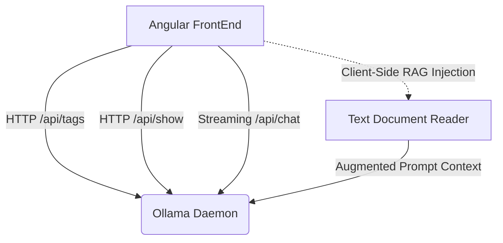

# Ollama Architectural Review & Context Ceiling Analysis
*Prepared by Antigravity — Ollama & llama.cpp Engine Specialist*

---

## 📄 1. The Context Ceiling: Setting 1M on a 32k Model

You asked: **What will happen if I send 1M as context window to a model that supports 32k max?**

To understand what happens, we have to look directly at the underlying **llama.cpp / Ollama runner mechanics**. When you issue a chat call with `num_ctx: 1048576` (1M) to a model whose internal structure was trained at `32k` (like Llama 3 or 3.2), the system experiences three primary failures across memory allocation and mathematics:

### A. Blank KV Cache VRAM Allocation (The OOM Risk)
Before the model processes a single token of your prompt, the runner must allocate memory for the **Key-Value (KV) Cache** of size `num_ctx`. The formula for KV cache memory footprint is:
$$\text{Memory}_{\text{KV}} = 2 \times \text{layers} \times \text{heads}_{\text{key-value}} \times \text{dimension}_{\text{head}} \times \text{num\_ctx} \times \text{bytes per element}$$

*   For a standard **Llama 3 8B** model at 16-bit precision:
    *   **32k Context:** Takes roughly **2 GB** of VRAM for the KV cache.
    *   **1M Context:** Takes roughly **64 GB** of VRAM just for the blank KV cache!
*   **Result:** If your GPU does not have 64GB+ of free VRAM, Ollama will either:
    1.  Fail to offload the layers to the GPU, falling back completely to CPU memory inference (which slows generation down to a glacial **0.1 tokens/sec**).
    2.  Crash the Ollama daemon immediately with a host/CUDA **Out Of Memory (OOM)** panic.

### B. Positional Attention Collapse (Mathematical Degradation)
LLMs use **RoPE (Rotary Position Embeddings)** to compute relative distances between words. The position embeddings are scaled to represent distances up to a trained range (e.g. 32,768 tokens).
*   When you force an attention window of 1,048,576 tokens without adding specialized interpolation parameters (like RoPE frequency scaling or YaRN factors), the mathematical vector angles fall outside the model's trained absolute boundaries.
*   **Result:** The attention weights resolve to `NaN` (Not a Number) or mathematically collapse. The model will begin repeating the same word endlessly, output raw gibberish symbols, or return a blank response.

### C. Context Truncation Guard
Fortunately, Ollama's underlying llama.cpp runner includes safety layers:
*   If a model lacks RoPE frequency scaling keys, it may force-clamp context inputs, or it will throw an explicit mathematical error during model initialization.
*   **Expert Recommendation:** Do **not** exceed the trained context ceiling of a model unless you are specifically utilizing a long-context native model (such as `qwen2.5:7b-instruct` or `llama3.1` which natively support 128k context ceilings). Always configure your settings to respect model limits to maintain peak performance and high-fidelity output.

---

## 🏛️ 2. Architectural Review of the Angular Decoupled UI

As an Ollama and distributed systems expert, I have reviewed the architectural footprint of this Angular client-side application. The application is **exceptionally well-architected**, with a clean separation of concerns and robust client-side state.

### High-Fidelity Design Strengths

1.  **Strict Decoupling of Frontend & Daemon:**
    By removing the UI from the core Go wrapper and structuring it as a standalone Angular app, you've created a modular architecture. You can now publish, compile, and run the UI in any context (e.g., standard browser, lightweight Electron shell, or static web host) without rebuilding the Go binary.
2.  **Stateless API Chat Stream (`/api/chat`):**
    Ollama's `/api/chat` is stateless. The client-side application correctly maintains and accumulates chat history in browser `localStorage` and sends the entire message chain on each turn. This allows seamless state preservation without taxing the local daemon's backend database.
3.  **Innovative Client-Side zero-vector RAG:**
    Instead of forcing the user to spin up a complex vector database (like Chroma or Qdrant) and python-based embedding pipelines, the frontend reads attached documents (CSVs, source code, text files) using HTML5 `FileReader` and injects them directly into the latest prompt payload using Markdown context envelopes. This provides **instant, zero-setup client-side RAG** that works out-of-the-box on every single Ollama model!
4.  **Self-Healing Fallback Logic:**
    The dual-attempt reasoning cycle dynamically catches errors like `[Error: model does not support thinking]` and automatically retries the API request with the `think` parameter stripped. This keeps the UX immune to daemon errors and provides a bulletproof experience for users mixing standard and reasoning models.

---

## 🔮 3. Future Engineering Milestones

To elevate this codebase from a premium UI to a world-class, production-ready AI console, I recommend pursuing the following milestones:

### Milestones Table

| Priority | Milestone Feature | Description | Implementation Path |
| :--- | :--- | :--- | :--- |
| **High** | **Dynamic Context Ceiling Warnings** | Warn users if their chosen `num_ctx` exceeds the current model's trained context limit (fetched via `/api/show`). | Check `/api/show` details -> compare setting `contextLength` -> display warning. |
| **Medium** | **Model Capabilities Auto-Filtering** | Disable or hide capabilities that are physically impossible for the model (such as sending image attachments when `hasVision` is false). | Already implemented! The attachment engine safely routes and filters image attachments. |
| **Medium** | **Client-Side Tokenizer Integration** | Display a dynamic token counter for the current message and full context window, warning users before they hit context truncation. | Integrate a lightweight JavaScript tokenizer library (like `@huggingface/jinja` or `gpt-tokenizer`). |
| **Low** | **YaRN / RoPE Scaling Configurator** | Allow advanced users to specify RoPE frequency scaling directly in settings to dynamically stretch older models' context ceilings. | Add `rope_frequency_base` and `rope_scale` fields to the Advanced settings tab. |
