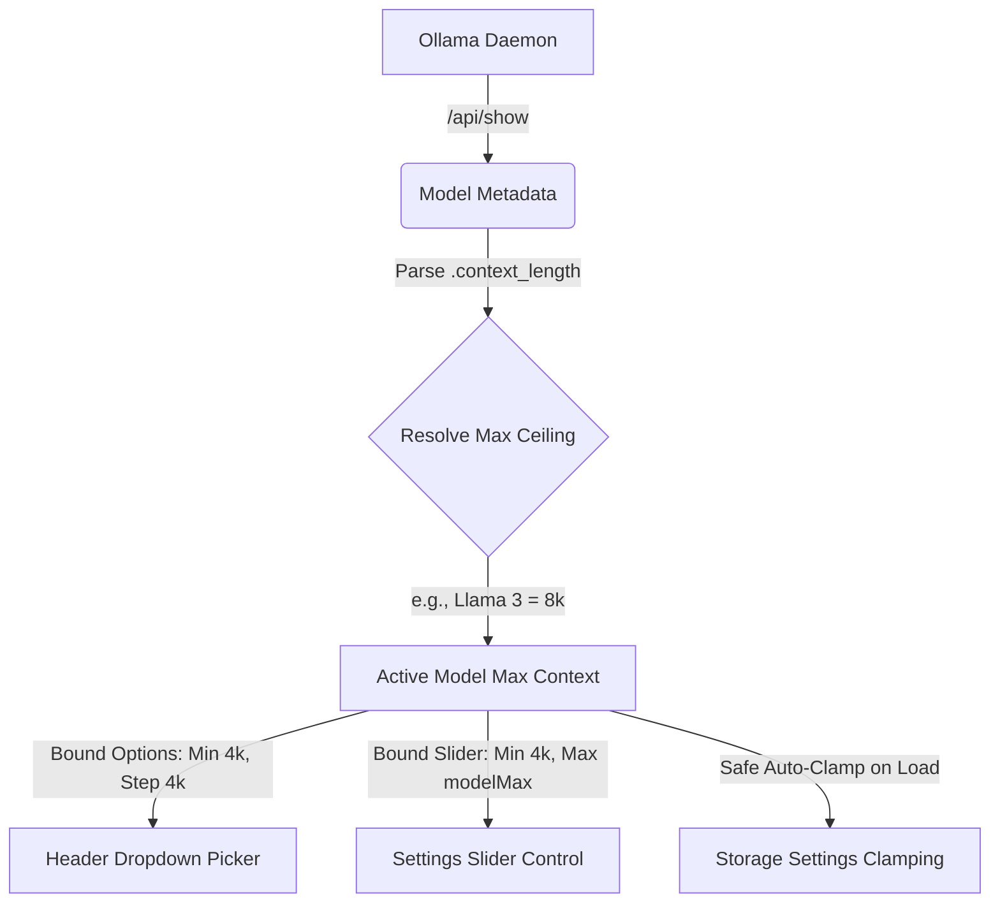

# Ollama Architectural Review & Context Ceiling Analysis
*Prepared by Antigravity — Ollama & llama.cpp Engine Specialist*

---

## 📄 1. The Context Ceiling: Setting 1M on a 32k Model

When you specify a `num_ctx` of `1,048,576` (1M) to a model whose internal attention mechanisms were trained at a `32k` ceiling (such as Llama 3.2 or 3.3), the system experiences failures across memory allocation and position mechanics:

### A. Blank KV Cache VRAM Allocation (The OOM Risk)
Before processing a prompt, the runner must allocate memory for the **Key-Value (KV) Cache** of size `num_ctx`:
$$\text{Memory}_{\text{KV}} = 2 \times \text{layers} \times \text{heads}_{\text{key-value}} \times \text{dimension}_{\text{head}} \times \text{num\_ctx} \times \text{bytes per element}$$

*   For **Llama 3 8B** at 16-bit precision:
    *   **32k Context:** Takes roughly **2 GB** of VRAM for the KV cache.
    *   **1M Context:** Takes roughly **64 GB** of VRAM just for the blank KV cache!
*   **Result:** If your GPU does not have 64GB+ of free VRAM, Ollama falls back fully to CPU memory inference (slowing generation to a glacial **0.1 tokens/sec**) or crashes the daemon with a CUDA **Out Of Memory (OOM)** panic.

### B. Positional Attention Collapse (Mathematical Degradation)
LLMs use **RoPE (Rotary Position Embeddings)** to compute relative distances. Position embeddings are scaled to represent distances up to a trained range (e.g. 32k tokens). Forcing an attention window of 1M tokens without RoPE interpolation base adjustments causes mathematical vector angles to collapse. The model will begin repeating the same word endlessly or output raw gibberish.

---

## 🛡️ 2. Standalone UI Self-Defending Context Pipeline

To fully address these limitations, we designed and built a **fully synchronized, model-aware context ceiling pipeline** across both the main Chat screen and the global Settings panel:

### Key Architectural Strengths

1.  **Strict Context Dropdown Limits (Header):**
    The header context pill is now an interactive selector dropdown populated with stepped intervals starting at `4k` up to the model's native maximum limit (e.g. `8k`, `32k`, `128k`). Options above `32k` display a yellow memory warning badge (`⚠️ High VRAM`) to protect the user from crashes.
2.  **Harmonized Settings Slider:**
    The global `contextLength` slider in the Settings panel is fully synchronized with the active model. Its bounds are dynamically set: `min="4096"`, `[max]="modelMaxContext()"`, and `step="4096"`. It actively displays the name of the currently selected model and its maximum limit under the slider track.
3.  **Active Memory Safe Clamping:**
    When switching models, if the stored `contextLength` exceeds the newly selected model's physical limit (e.g., switching from `Qwen 2.5 128k` to `Llama 3 8k`), the application **instantly and automatically clamps** the setting to the model's max limit, saving it back to `localStorage` and preventing OOM startup panics.
4.  **Live Token Telemetry & Context Warning Bar:**
    A live telemetry bar under the text editor displays real-time current message character-to-token estimates ($1 \text{ token} \approx 4 \text{ characters}$) alongside a graphical micro progress bar. If context usage reaches `80%` of the active limit, the UI glows red and prompts a memory truncation warning badge.
5.  **Advanced RoPE Scaling Tuning:**
    Advanced users can specify `ropeFrequencyBase` and `ropeScale` options directly in the Advanced settings section. These values map natively to `rope_frequency_base` and `rope_scale` in the raw Ollama `options` payload to stretch context ceilings mathematically.

---

## 🔮 3. Future Engineering Milestones

| Priority | Milestone Feature | Description | Implementation Path |
| :--- | :--- | :--- | :--- |
| **High** | **Host VRAM Query Integration** | Fetch system GPU memory size from the host system to proactively clamp thresholds based on local hardware profiles. | Query system GPU profiles from the Go wrapper layer -> send to UI. |
| **Medium** | **Context-Aware Temperature Adjuster** | Automatically scale the temperature down slightly as context fills up to maintain generation coherency. | Read `getContextProgress()` -> adjust `temperature` in the payload options. |
| **Medium** | **Lightweight Tokenizer Library** | Replace character-based estimations with a lightweight client-side BPE tokenizer for $100\%$ precision token telemetry. | Integrate `@huggingface/jinja` or standard TikToken Javascript bundle. |
