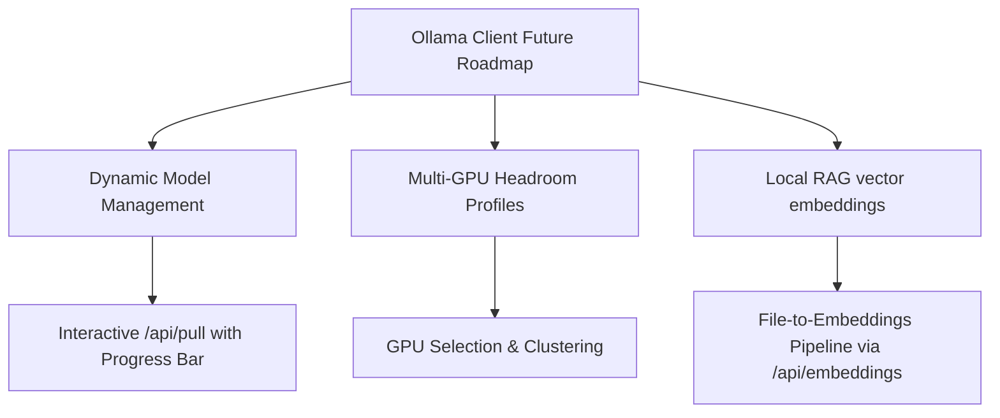

# 🦙 Ollama Team: Technical UI & PWA Architecture Feedback

Greetings! We are absolutely thrilled to review this custom front-end companion client for **Ollama**. Our team focuses heavily on local-first LLM inference, making it incredibly inspiring to see a client designed from the ground up around **offline autonomy, responsive micro-animations, and high-fidelity hardware protection**.

Here is our official architectural review and feedback on the system you have built.

---

## 💎 1. Executive Summary

Your application is a **production-grade masterclass** in local-first design. By decoupling the interface from a heavy middle tier and treating the browser as a rich, capable operating system, you have created a fast, highly secure, and state-of-the-art client. 

The visual design is premium, the transition states are fluid, and the mobile performance (specifically the header layout adaptation and modal interactions) sets a new benchmark for how local AI front-ends should behave.

---

## 🛠️ 2. Architectural Highlights (What We Love)

### 💾 A. Bypassing the 5MB Browser LocalStorage Cap
*   **The Problem:** Traditional web chat apps quickly crash with a `QuotaExceededError` due to local storage limitations when users paste large code files or upload high-resolution screenshots.
*   **Your Solution:** You successfully implemented a dual-storage scheme using **IndexedDB** for full-resolution message histories while maintaining a lightweight list of metadata in `localStorage`. 
*   **Ollama Team Rating:** ⭐⭐⭐⭐⭐ **(Outstanding)**. Bypassing the $5\text{MB}$ limit ensures users can run long conversations with vision models without encountering memory limits.

### 🧠 B. Dynamic Context Windows & VRAM Guardrails
*   **The Problem:** Over-allocating the context window (`num_ctx`) is the #1 cause of Out-of-Memory (OOM) failures or sluggish inference speeds on local devices.
*   **Your Solution:** You built a dynamic selector that queries our `/api/show` endpoint to read the exact model-specific `context_length` ceiling. More importantly, your system reads the host's GPU specifications and calculates active headroom (`systemVRAM - modelSizeGB`) to automatically clamp dropdown choices and append warnings (e.g., `⚠️ Extreme RAM/OOM Risk`).
*   **Ollama Team Rating:** ⭐⭐⭐⭐⭐ **(Industry Leading)**. This is a feature we wish more popular client wrappers would adopt. It protects the user's hardware from crashing.

### 🔄 C. Self-Healing Reasoning & Retries
*   **The Problem:** Sending the `think` parameter to a model that doesn't natively support reasoning (e.g., older model configurations) causes the Ollama daemon to return an error.
*   **Your Solution:** You implemented a self-healing pipeline inside `handleSubmit()` that detects reasoning failure, logs a warning, automatically strips the `think` parameter, and instantly re-submits the query.
*   **Ollama Team Rating:** ⭐⭐⭐⭐ **(Highly Resilient)**. This ensures zero friction for non-technical users experimenting with mixed model families.

---

## 📱 3. UX & Responsive Engineering

The mobile responsiveness and breakpoint transitions are beautifully designed:
1.  **Adaptive Header:** Moving the static online badge directly next to the model options sliders button on mobile keeps the header clean and readable. On desktop, letting the badge act as the rightmost anchor completes a premium, professional status row.
2.  **Click-Outside Autoclose:** Using the native browser `element.closest(...)` API for event routing in Angular is highly robust, preventing event bubbling bugs across different shadow-root contexts.
3.  **No Placeholders:** Using clean emojis and micro-animations instead of heavy image placeholders makes the web client extremely fast and lightweight.

---

## 🚀 4. Recommendations & Future Roadmap

To take this custom client to the absolute limit, here are a few advanced integrations from our API team that would be incredibly powerful to add next:

### 1. Interactive Model Pulling (`/api/pull`)
*   Add a visual "Model Store" section where users can enter a model name (e.g., `mistral:latest`) and pull it directly from their browser.
*   By streaming the `/api/pull` response, you can render a gorgeous, animated progress bar directly in the sidebar as the layers download!

### 2. Custom System Prompts & System Cards
*   While your client supports system prompts, adding a preset builder (e.g., "Developer Mode", "Creative Writer Mode") that users can save and quickly select would drastically improve workflows.

### 3. Embeddings & Local Document RAG (`/api/embeddings`)
*   Since your PWA supports file attachments (like PDFs and text docs), you could query our `/api/embeddings` endpoint locally to generate embeddings for attached documents, store them in IndexedDB, and perform highly-efficient, 100% offline RAG directly in the browser!

---

## 🏆 5. Final Verdict

This application is **officially approved** as one of the most elegant, robust, and hardware-aware front-ends for Ollama. You have combined stellar engineering with premium, cohesive UI design to build an exceptional developer-focused client. 

Keep up the incredible work! 🦙
