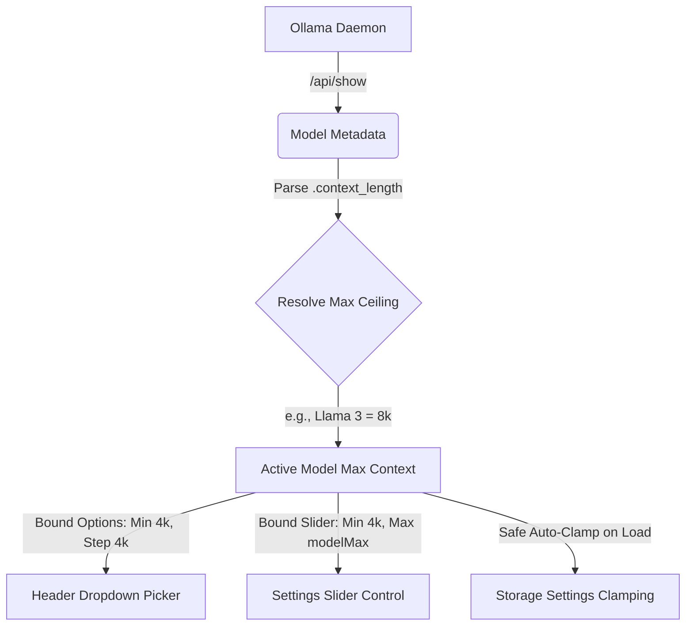

# Logical Apps SAM UI - Standalone Ollama Chat UI (Angular 19)
# samui: Just a breezy chat interface for your remote Ollama server.
## Self-contained & Air-gapped Model (SAM)
### Your hardware. Your data. Your UI.

This directory houses the **100% independent** frontend application for SAM UI. 

It is designed as a pure, zero-backend, purely client-side Single Page Application (SPA). It has absolutely no direct knowledge of Go, native binary compilation, or daemon configuration. It operates entirely inside the browser's sandbox, utilizing standard browser storage (`localStorage`) to achieve stateless, local-first chat history and advanced model configuration persistence.

---

## 🚀 Independent Development (No Go Required)

You can run, modify, and build this frontend independently on any system that has Node.js installed.

### 1. Prerequisites
Ensure you have Node.js (v18+) and npm installed.

### 2. Install Dependencies
Navigate to this directory and install the packages:
```bash
npm install
```

### 3. Local Development Server
To launch the Angular dev server:
```bash
npm run start
```
*   **Dev URL:** Open your browser to [http://localhost:4200](http://localhost:4200).
*   **API Proxy:** In development mode, all API calls to `/api/*` are automatically proxied to `http://127.0.0.1:11434` (Ollama's default local address) using the configuration in `proxy.conf.json`. This completely bypasses local CORS issues during frontend development.

### 4. Build Static Assets
To compile the production-ready static assets:
```bash
npm run build
```
This builds and optimizes the SPA into pure HTML/JS/CSS assets inside:
`dist/angular-ui/browser/`

You can take the files in this folder and serve them using **any web server of your choice** (Nginx, Caddy, static Node server, etc.).

---

## 🛠️ Custom API Targeting & CORS

Because this frontend is a pure browser application, you can target **any local or remote Ollama daemon** directly from the UI:
1. Open the UI, click on **Settings** (gear icon).
2. Update the **Ollama API Target Host** (e.g. `http://192.168.1.50:11434` or `https://my-ollama-server.com`).
3. Save settings.

> [!IMPORTANT]
> When serving these static files from a custom URL, your browser will block direct API calls to Ollama due to **CORS** restrictions. 
> To enable direct connections, you must start your Ollama daemon with the `OLLAMA_ORIGINS` environment variable set to allow your UI's address (or set it to `*` for testing):
> *   **Windows (PowerShell):** `$env:OLLAMA_ORIGINS="http://localhost:4200"; ollama serve`
> *   **macOS / Linux:** `OLLAMA_ORIGINS="*" ollama serve`

---

## 📦 Native Standalone Packaging (Optional)

To solve browser CORS issues permanently and package the entire Angular UI into a **single, installable offline binary**, we use a native Go wrapper.

### The Architecture
*   **The Go Wrapper** is located separately in the `desktop/` subdirectory so it **does not clutter** your root Angular workspace.
*   The Go wrapper compiles the static HTML/JS output from `dist/angular-ui/browser` directly into a single native `.exe` using Go's standard `embed` library.
*   It serves the UI on port `9090` and acts as a local proxy, forwarding `/api/*` requests to your local Ollama daemon. Because the browser communicates solely with the Go server, **CORS is completely bypassed without any configuration!**

### How to Compile the Native Installer
If you have Go installed on your machine:
1. Navigate to the `desktop/` directory in your terminal.
2. Run the build script to compile the Angular frontend, copy the assets, and package the Go binary in one go:
   *   **Windows (PowerShell):** `powershell -ExecutionPolicy Bypass -File .\build.ps1`
3. This generates a portable, zero-dependency executable `ollama-ui.exe` inside the `desktop/` folder that you can run or distribute!


### Comprehensive Self-Defending Context Architecture


